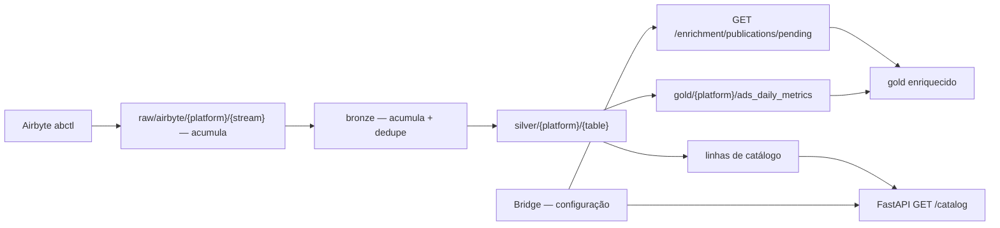

# Arquitetura — lake, enriquecimento e publicação

Invariantes que governam tudo isso: [../CLAUDE.md](../CLAUDE.md). Modelo Bridge no lado do
backend: `binder_app_backend/docs/architecture.md`.

## Três zonas

| Zona | Dono | Responsabilidade |
|---|---|---|
| Lake (`raw` → `gold`) | ETL / MinIO | Fatos com IDs nativos de plataforma |
| Catalog API | FastAPI do ETL (`src/api/`) | Identidades da hierarquia, lidas do silver — alimenta a descoberta do Bridge |
| Metadados do Bridge | Postgres do backend | Vínculos e classificações (SSOT do backend) |



## Extração (Airbyte)

Configuração do conector TikTok Marketing:

| Stream | Modo de sync |
|---|---|
| `advertisers` | Full Refresh + Append |
| `campaigns`, `ad_groups`, `ads` | Incremental + Append |
| `ads_reports_daily` | Incremental + Append |

- **Include Deleted Data** ligado — sem ele, objetos deletados nunca chegam às dimensões,
  mas as métricas deles chegam ao relatório.
- **`start_date` 2025-01-01.** As streams incrementais só trazem objetos modificados desde
  essa data; objeto não tocado desde antes dela não entra na dimensão.
- **Mudar `start_date` ou Include Deleted exige Clear data dos streams.** O cursor do
  incremental vive no Airbyte, não no MinIO — limpar o raw não o reseta, e o próximo sync
  continua de onde parou.

Comportamentos do conector que o pipeline precisa absorver:

- **`advertiser_id` vem `NULL`** no `ads_reports_daily`, tanto no nível superior quanto em
  `dimensions.advertiser_id`. O fato só traz `ad_id`, `metrics.adgroup_id` e
  `metrics.campaign_id`; a conta deriva da hierarquia.
- **Uma linha por ad por dia, mesmo sem entrega.** Cerca de dois terços do relatório têm
  todas as métricas zeradas — ver [Linhas sem atividade](#linhas-sem-atividade).
- **Reextração do mesmo ad × dia** entre syncs incrementais — o dedupe do bronze é
  obrigatório, não otimização.

**Completude e conservação são problemas diferentes.** A extração decide *o que* chega ao
lake; os joins decidem se *o que chegou* sobrevive até o gold. O `LEFT JOIN` garante o
segundo, nunca o primeiro — dimensão faltando por extração incompleta aparece como `NULL`,
não como erro.

## Existência de objeto

Deletados chegam explicitamente em `secondary_status` — `CAMPAIGN_STATUS_DELETE`,
`ADGROUP_STATUS_DELETE`, `ADGROUP_STATUS_CAMPAIGN_DELETE`, `AD_STATUS_DELETE`,
`AD_STATUS_ADGROUP_DELETE`, `AD_STATUS_CAMPAIGN_DELETE`.

**"Ainda existe na plataforma?" se responde pelo status, não por `_airbyte_extracted_at`.**
No incremental um objeto só é reextraído quando muda, então `extracted_at` é a última
*modificação vista*, não a última vez que o objeto existiu.

## A acumulação no bronze

O raw acumula um arquivo por sync, mas o bronze não depende disso: ele é a camada
acumuladora. Isso protege o histórico se o raw ganhar retenção ou compactação, ou se algum
stream — desta plataforma ou de uma futura — só oferecer Overwrite.

Em `bronze.py`, a leitura do bronze existente e a decisão de unir ficam separadas
(`_read_existing_bronze` faz I/O, `_accumulate` é pura):

```python
new = read_raw_parquet(spark, stream.raw_path)
existing = self._read_existing_bronze(stream)      # None na primeira execução
combined = self._accumulate(existing, new)          # existing.unionByName(new, ...) ou só new

cleaned = self.dedupe(combined, list(stream.dedupe_columns))
cleaned.cache()
cleaned.count()                       # materializa antes de sobrescrever a origem
write_delta(cleaned, "bronze", stream.bronze_table_name, mode="overwrite")
```

`BaseTransformer.dedupe` ordena por `_airbyte_extracted_at desc`, então a versão mais
recente vence — o SCD tipo 1, entre rodadas e dentro de uma rodada.

`tests/transformers/tiktok/bronze/test_accumulate.py` prova o cenário que importa sem MinIO:
um objeto presente no bronze mas ausente do raw desta rodada sobrevive a `_accumulate` +
`dedupe`.

### Chave de dedupe: a chave natural mínima

O raw e o bronze acumulam versões de cada objeto. Com chave composta, um ad que mudasse de
ad_group teria duas versões com chaves diferentes, o dedupe não colapsaria, e a métrica
duplicaria no join do gold. Por isso cada stream deduplica só pelo próprio id:

| Stream | Chave de dedupe |
|---|---|
| `advertisers` | `advertiser_id` |
| `campaigns` | `campaign_id` |
| `ad_groups` | `adgroup_id` |
| `ads` | `ad_id` |
| `ads_reports_daily` | `ad_id, stat_time_day` |

### Outras ressalvas

- **Materialize antes de escrever** (`.cache()` + `.count()`). Lê-se e sobrescreve-se o mesmo
  caminho; o Delta resolve por snapshot isolation, mas forçar a avaliação elimina surpresa de
  lazy evaluation.
- **Read-modify-write relê a tabela inteira** a cada rodada. Em centenas de objetos é
  irrelevante; se virar milhões, aí sim vale um `MERGE`. É problema de escala, não de
  correção.

## Linhas sem atividade

O transform silver de `ads_reports_daily` descarta ad × dia em que **todas** as métricas
numéricas são nulas ou zero. Uma linha com spend 0 mas alguma conversão sobrevive. Nenhuma
soma muda, porque o que sai já era zero — o teste de conservação cobre bronze × silver.

Unitário: `tests/transformers/tiktok/silver/test_ads_reports_daily_filter.py`.

## Gold partindo do fato

Em `transforms/gold/ads_daily_metrics.py`:

- **Base é o fato** (`ads_reports_daily`); `ads`, `ad_groups`, `campaigns` e `advertisers`
  entram por `LEFT JOIN`.
- **Chaves de hierarquia vêm do fato** (`campaign_id`, `ad_group_id`, `ad_id`), que sempre as
  carrega — não das dimensões, que podem faltar.
- **`ad_account_id` vem da dimensão `ads`**, porque o fato não o traz. Linha sem dimensão
  `ads` fica com conta `NULL`, mesmo que a campanha esteja vinculada.
- **Atributo de dimensão ausente vira `NULL` no gold base**, não `'Não informado'`. O balde
  explícito é responsabilidade do gold enriquecido; no gold base, `NULL` é o registro preciso
  de "faltou a dimensão".

**Função pura, sem I/O.** `transform(sources, fact)` recebe um dict `{nome do silver source:
DataFrame}` já carregado e devolve o gold. Quem faz I/O é `TikTokGoldTransformer` em
`gold.py`, que lê cada silver source uma vez. É o que torna a regra testável sem MinIO:
`tests/transformers/tiktok/gold/test_ads_daily_metrics.py` constrói uma linha de fato órfã,
sem nenhuma dimensão, e prova que ela sobrevive. Esse teste é a garantia do `LEFT JOIN` — o
de conservação sozinho não basta, porque o filtro do silver remove os órfãos vazios que
exporiam um `inner join`.

## Contrato de join com o Bridge

`BridgeMapping` em `tables.py` documenta quais colunas do silver são chave de join para o
Bridge. Não é dado de mapeamento — é o contrato de "qual coluna do lake casa com qual coluna
do Bridge".

| Coluna silver | Alvo no Bridge |
|---|---|
| `ad_account_id` | `platform_account.external_account_id` |
| `campaign_id` | `platform_campaign_binding.external_campaign_id` |
| `ad_group_id` | `platform_ad_group_classification.external_ad_group_id` |
| `ad_id` | `platform_ad_classification.external_ad_id` |

No fato, `ad_account_id` é derivado (ver [Gold partindo do fato](#gold-partindo-do-fato)),
não nativo.

## Gold enriquecido

Desenho alvo:

```
gold_enriched = ads_daily_metrics
    LEFT JOIN enrichment_campaign  ON (ad_account_id, campaign_id)
    LEFT JOIN enrichment_ad_group  ON (ad_account_id, ad_group_id)
    LEFT JOIN enrichment_ad        ON (ad_account_id, ad_id)
```

Três `LEFT JOIN` em três chaves diferentes. **Sem `coalesce`, sem regra de precedência, sem
resolução de conflito** — porque nenhum atributo é declarado em dois níveis. A herança
acontece sozinha: a linha do fato é ad × dia e já carrega `campaign_id` e `ad_group_id`, então
o atributo declarado acima desce pelo próprio join.

Como `ad_account_id` é derivado no fato, uma linha sem dimensão `ads` não casa com um
enriquecimento que use a conta na chave, mesmo que a campanha esteja vinculada.

### Eixos dinâmicos viram um MAP, não colunas

Os eixos são declarados por campanha, então pivotar para colunas faria o schema do gold mudar
toda vez que uma campanha ganhasse um eixo. Use `enrichment MAP<STRING, STRING>` — o filtro
fica `enrichment['Território'] = 'Canais'`, sem churn de schema e com sintaxe única para
qualquer eixo.

### Formato traduzido

O backend entrega a tradução `(platform, native_value) → (format, sub_format)` junto da
publicação. Valor nativo sem tradução **nunca quebra a rodada**: o ad recebe `'Não mapeado'`
e o gold carrega `format_native_value` com o valor cru, para o backend montar a fila de
pendências ordenada por investimento afetado.

`ad_format` do TikTok tem cardinalidade muito baixa:

- `SINGLE_VIDEO` concentra a maior parte do investimento;
- `CAROUSEL_ADS` inclui os anúncios ACO (`is_aco = true`);
- **nulo** é valor legítimo: são os posts autorizados (`identity_type = BC_AUTH_TT`).

`ad_format` distingue vídeo de carrossel, mas **não carrega duração** — não separa 15s de 30s.

## Invariante de conservação

> A soma de qualquer métrica no gold enriquecido, sem filtro, tem que ser idêntica à soma no
> fato cru. Se divergir, o enriquecimento está comendo dado.

- Todo join é `LEFT`, sem exceção — no gold base e no enriquecido.
- `NULL` vira balde explícito no enriquecido: `'Não informado'` é categoria legítima que
  aparece nos gráficos, não filtro implícito.
- **A invariante é teste automático.** `tests/transformers/tiktok/test_conservation.py`
  compara linhas, `spend`, `impressions` e `clicks` entre bronze × silver e silver × gold.
  Divergência para menos é join descartando (ou filtro cortando linha com atividade); para
  mais é fan-out.
- **Linha não é dinheiro.** Meça a divergência pela soma de métrica antes de dimensionar o
  problema: uma perda grande em linhas pode ser quase nada em spend, e vice-versa.

## Publicação

Configurar no backend não dispara processamento. Publicar sim, uma vez para o lote inteiro.

O DAG busca `GET /enrichment/publications/pending` no backend e usa **aquele snapshot**, nunca
as tabelas vivas — isso torna a rodada reprodutível mesmo com alguém editando. O gold
enriquecido carrega `enrichment_publication_id`, o que dá o rastro de auditoria que o SCD
tipo 1 não guarda: não se sabe *quando* um ad_group mudou de território, mas se sabe que a
publicação #7 gerou aqueles números e a #8 gerou estes.

Transporte por HTTP e não por JDBC ou S3: é simétrico ao `catalog-api` que já existe na
direção oposta, não exige credencial S3 no backend nem driver JDBC no Spark. O snapshot é da
ordem de mil linhas de JSON — `spark.createDataFrame()` resolve. Se crescer, troca-se por
parquet no MinIO sem mudar o modelo.
