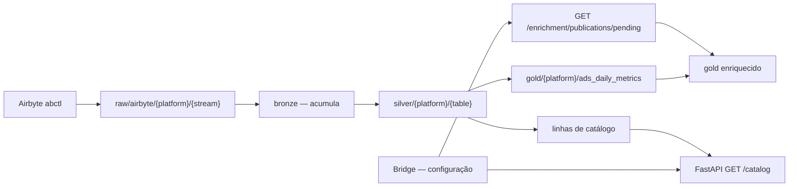

# Arquitetura — lake, enriquecimento e publicação

Invariantes que governam tudo isso: [../CLAUDE.md](../CLAUDE.md). Modelo Bridge no lado do
backend: `binder_app_backend/docs/architecture.md`.

## Três zonas

| Zona | Dono | Responsabilidade |
|---|---|---|
| Lake (`raw` → `gold`) | ETL / MinIO | Fatos com IDs nativos de plataforma |
| Catalog API | FastAPI do ETL (`src/api/`) | Identidades da hierarquia, lidas do silver — alimenta a descoberta do Bridge |
| Metadados do Bridge | Postgres do backend | Vínculos e classificações (SSOT do backend) |



## A acumulação no bronze

Hoje o bronze lê o snapshot atual do raw e sobrescreve, jogando o histórico fora. Como as
dimensões vêm em Full Refresh e o fato vem em Append, todo objeto que deixou de existir na
plataforma perde sua linha de dimensão mas mantém suas métricas — e o `inner join` do gold
descarta.

A correção acumula na primeira camada que é nossa:

```python
new = read_raw_parquet(spark, stream.raw_path)

try:
    existing = read_delta(spark, "bronze", stream.bronze_table_name)
    combined = existing.unionByName(new, allowMissingColumns=True)
except AnalysisException:            # primeira execução
    combined = new

cleaned = self.dedupe(combined, list(stream.dedupe_columns))
cleaned.cache(); cleaned.count()     # materializa antes de sobrescrever a origem
write_delta(cleaned, "bronze", stream.bronze_table_name, mode="overwrite")
```

Por que aqui e não no conector: os modos de sync disponíveis variam por conector e não estão
sob nosso controle — vale para a Kwai e para toda plataforma futura. `BaseTransformer.dedupe`
já ordena por `_airbyte_extracted_at desc`, então a versão mais recente vence, que é
exatamente o SCD tipo 1.

### Armadilha: chave de dedupe composta demais

Hoje é inofensivo porque o raw só tem um snapshot. **Com acumulação**, se um ad mudar de
ad_group, as duas versões têm chaves compostas diferentes, o dedupe não colapsa, e a métrica
**duplica** no join do gold.

| Stream | Hoje | Deve ser |
|---|---|---|
| `advertisers` | `advertiser_id` | `advertiser_id` ✓ |
| `campaigns` | `advertiser_id, campaign_id` | `campaign_id` |
| `ad_groups` | `advertiser_id, campaign_id, adgroup_id` | `adgroup_id` |
| `ads` | `advertiser_id, campaign_id, adgroup_id, ad_id` | `ad_id` |

### Outras ressalvas

- **Materialize antes de escrever** (`.cache()` + `.count()`). Lê-se e sobrescreve-se o mesmo
  caminho; o Delta resolve por snapshot isolation, mas forçar a avaliação elimina surpresa de
  lazy evaluation.
- **Read-modify-write relê a tabela inteira** a cada rodada. Em 311 ads é irrelevante; se
  virar milhões, aí sim vale um `MERGE`. É problema de escala, não de correção.
- **O histórico anterior a hoje já foi perdido** nas dimensões e não volta. A partir daqui
  para de sangrar.
- Se o incremental **estiver** disponível no Airbyte, ligue mesmo assim — reduz chamada de API
  e churn no raw. Mas deixou de ser requisito de correção.

## Contrato de join com o Bridge

`BridgeMapping` em `tables.py` documenta quais colunas do silver são chave de join para o
Bridge. Não é dado de mapeamento — é o contrato de "qual coluna do lake casa com qual coluna
do Bridge".

| Coluna silver | Alvo no Bridge |
|---|---|
| `ad_account_id` | `platform_account.external_account_id` |
| `campaign_id` | `platform_campaign_binding.external_campaign_id` |
| `ad_group_id` | `platform_ad_group_classification.external_ad_group_id` |
| `ad_id` | `platform_ad_classification.external_ad_id` |

## Gold enriquecido

```
gold_enriched = ads_daily_metrics
    LEFT JOIN enrichment_campaign  ON (ad_account_id, campaign_id)
    LEFT JOIN enrichment_ad_group  ON (ad_account_id, ad_group_id)
    LEFT JOIN enrichment_ad        ON (ad_account_id, ad_id)
```

Três `LEFT JOIN` em três chaves diferentes. **Sem `coalesce`, sem regra de precedência, sem
resolução de conflito** — porque nenhum atributo é declarado em dois níveis. A herança
acontece sozinha: a linha do fato é ad × dia e já carrega `campaign_id` e `ad_group_id`, então
o atributo declarado acima desce pelo próprio join.

### Eixos dinâmicos viram um MAP, não colunas

Os eixos são declarados por campanha, então pivotar para colunas faria o schema do gold mudar
toda vez que uma campanha ganhasse um eixo. Use `enrichment MAP<STRING, STRING>` — o filtro
fica `enrichment['Território'] = 'Canais'`, sem churn de schema e com sintaxe única para
qualquer eixo.

### Formato traduzido

O backend entrega a tradução `(platform, native_value) → (format, sub_format)` junto da
publicação. Valor nativo sem tradução **nunca quebra a rodada**: o ad recebe `'Não mapeado'`
e o gold carrega `format_native_value` com o valor cru, para o backend montar a fila de
pendências ordenada por investimento afetado.

## Invariante de conservação

> A soma de qualquer métrica no gold enriquecido, sem filtro, tem que ser idêntica à soma no
> fato cru. Se divergir, o enriquecimento está comendo dado.

- Todo join de enriquecimento é `LEFT`, sem exceção. Vale revisitar os `inner` do gold atual
  pelo mesmo motivo.
- `NULL` vira balde explícito: `'Não informado'` é categoria legítima que aparece nos
  gráficos, não filtro implícito.
- **A invariante é teste automático do pipeline.** O job falha se os totais não baterem. É
  essa checagem que impede a regressão silenciosa.

## Publicação

Configurar no backend não dispara processamento. Publicar sim, uma vez para o lote inteiro.

O DAG busca `GET /enrichment/publications/pending` no backend e usa **aquele snapshot**, nunca
as tabelas vivas — isso torna a rodada reprodutível mesmo com alguém editando. O gold
enriquecido carrega `enrichment_publication_id`, o que dá o rastro de auditoria que o SCD
tipo 1 não guarda: não se sabe *quando* um ad_group mudou de território, mas se sabe que a
publicação #7 gerou aqueles números e a #8 gerou estes.

Transporte por HTTP e não por JDBC ou S3: é simétrico ao `catalog-api` que já existe na
direção oposta, não exige credencial S3 no backend nem driver JDBC no Spark. São ~450 linhas
de JSON hoje — `spark.createDataFrame()` resolve. Se crescer, troca-se por parquet no MinIO
sem mudar o modelo.

## Plano de migração

| # | Passo | Repo |
|---|---|---|
| 1 | Reduzir `dedupe_columns` à chave natural mínima | **etl** |
| 2 | Acumular no bronze | **etl** |
| 3 | Reprocessar o medallion e verificar a recuperação | **etl** |
| 4 | Criar as tabelas novas do Bridge | backend |
| 5 | Migrar dados de `platform_object_map` | backend |
| 6 | Tabela de tradução de formato + fila de pendências | backend |
| 7 | `enrichment_publication`, snapshot e endpoint | backend |
| 8 | Gold enriquecido: fetch, três `LEFT JOIN`, `MAP`, teste de invariante | **etl** |
| 9 | Telas de configuração | frontend |
| 10 | Remover `platform_object_map` | backend |

Os passos 1–3 são independentes do backend e podem começar já.

## A verificar

| Verificação | Bloqueia |
|---|---|
| 14 campanhas para 17 advertisers é plausível, ou a extração está incompleta? Se depois do passo 3 a diferença não cair, há uma segunda causa | passo 3 |
| Delta em read-modify-write no mesmo caminho — confirmar `.cache()` em execução real | passo 2 |
| Valores distintos de `ad_format` (esperado ~6) | passo 8 |

## Deferido

- Trigger automático do Airbyte no Airflow (hoje `abctl` manual)
- Segundo fato para segmentações (age, gender, region) — grão maior, mecanismo diferente
- Retenção/compactação do raw quando o volume justificar
