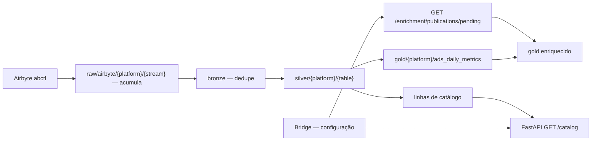

# Arquitetura — lake, enriquecimento e publicação

Invariantes que governam tudo isso: [../CLAUDE.md](../CLAUDE.md). Modelo Bridge no lado do
backend: `binder_app_backend/docs/architecture.md`.

## Três zonas

| Zona | Dono | Responsabilidade |
|---|---|---|
| Lake (`raw` → `gold`) | ETL / MinIO | Fatos com IDs nativos de plataforma |
| Catalog API | FastAPI do ETL (`src/api/`) | Identidades da hierarquia, lidas do silver — alimenta a descoberta do Bridge |
| Metadados do Bridge | Postgres do backend | Vínculos e classificações (SSOT do backend) |



## Extração (Airbyte)

Configuração do conector TikTok Marketing:

| Stream | Modo de sync |
|---|---|
| `advertisers` | Full Refresh + Append |
| `campaigns`, `ad_groups`, `ads` | Incremental + Append |
| `ads_reports_daily` | Incremental + Append |

- **Include Deleted Data** ligado — sem ele, objetos deletados nunca chegam às dimensões,
  mas as métricas deles chegam ao relatório.
- **`start_date` 2025-01-01.** As streams incrementais só trazem objetos modificados desde
  essa data; objeto não tocado desde antes dela não entra na dimensão.
- **Mudar `start_date` ou Include Deleted exige Clear data dos streams.** O cursor do
  incremental vive no Airbyte, não no MinIO — limpar o raw não o reseta, e o próximo sync
  continua de onde parou.

Comportamentos do conector que o pipeline precisa absorver:

- **`advertiser_id` vem `NULL`** no `ads_reports_daily`, tanto no nível superior quanto em
  `dimensions.advertiser_id`. O fato só traz `ad_id`, `metrics.adgroup_id` e
  `metrics.campaign_id`; a conta deriva da hierarquia.
- **Uma linha por ad por dia, mesmo sem entrega.** 66% do fato (14.967 de 22.739 linhas) tem
  as 59 métricas zeradas.
- **Reextração do mesmo ad × dia** entre syncs incrementais — o dedupe do bronze é
  obrigatório, não otimização.

## Diagnóstico da perda de linhas no gold

Medido em 11/09/2026, reproduzível com `tests/test_conservation_tiktok.py`.

**Antes da correção** (`start_date` 2026-01-01, sem deletados): o fato tinha 8.744 linhas e
o gold 4.216. Todas as linhas perdidas tinham `campaign_id` ausente da dimensão `campaigns`
— 54 das 68 campanhas do fato. Em dinheiro, R$ 30.065,43 (1,45% do spend), concentrados em
01–02/01/2026: campanhas de 2025 que terminaram no início da janela e nunca mais foram
modificadas. Descartados: fan-out (dimensões sem id duplicado), hierarquia divergente no
join composto (0 casos) e duplicata no fato (0 pares ad × dia).

**A hipótese de ontem estava errada.** Supunha-se que as dimensões vinham em Full Refresh +
Overwrite, com um único snapshot no raw. Na verdade o raw já acumulava um arquivo por sync;
o que faltava era a extração trazer os objetos.

**Depois da correção** (Include Deleted, `start_date` 2025-01-01, Clear data):

| | Silver (fato) | Gold |
|---|---|---|
| Linhas | 22.739 | 21.781 |
| Spend | R$ 9.073.343,49 | R$ 9.073.343,49 |
| Impressões | 2.296.452.634 | 2.296.452.634 |
| Cliques | 13.844.358 | 13.844.358 |

As 958 linhas restantes são de 85 campanhas cuja última modificação é anterior a 2025.
Nenhuma das 59 métricas é diferente de zero nessas linhas. O `inner join` ainda as descarta;
o passo 1 do plano fecha isso.

**A lição:** conservação (os joins) e completude (a extração) são problemas diferentes. O
`LEFT JOIN` garante que nada some *dado o que foi extraído*; só a extração garante que o
extraído é tudo.

## Existência de objeto

Deletados chegam explicitamente em `secondary_status` — `CAMPAIGN_STATUS_DELETE`,
`ADGROUP_STATUS_DELETE`, `ADGROUP_STATUS_CAMPAIGN_DELETE`, `AD_STATUS_DELETE`,
`AD_STATUS_ADGROUP_DELETE`, `AD_STATUS_CAMPAIGN_DELETE`.

**"Ainda existe na plataforma?" se responde pelo status, não por `_airbyte_extracted_at`.**
No incremental um objeto só é reextraído quando muda, então `extracted_at` é a última
*modificação vista*, não a última vez que o objeto existiu.

## Gold partindo do fato — feito (14/09/2026)

Até aqui o gold encadeava quatro `inner join` a partir do relatório e selecionava as chaves
pelas dimensões (`tc.campaign_id`, `tag.ad_group_id`). Qualquer lacuna de extração virava
linha perdida — foi essa a causa da perda de R$ 30.065,43 registrada acima.

Implementado em `transforms/gold/ads_daily_metrics.py`:

- **Base é o fato** (`ads_reports_daily`); `ads`, `ad_groups`, `campaigns` e `advertisers`
  entram por `LEFT JOIN`.
- **Chaves de hierarquia vêm do fato** (`campaign_id`, `ad_group_id`, `ad_id`), que sempre as
  carrega — não das dimensões, que podem faltar.
- **`ad_account_id` vem da dimensão `ads`**, porque o fato não o traz. Linha sem dimensão
  `ads` fica com conta `NULL`, mesmo que a campanha esteja vinculada.
- **Atributo de dimensão ausente vira `NULL` no gold base**, não `'Não informado'`. O balde
  explícito é decisão do gold *enriquecido* (passo 8), que já vai ler o gold base e decidir
  o que fazer com cada `NULL` junto do enriquecimento — aqui, `NULL` é o registro preciso de
  "faltou a dimensão".

**Função pura, sem I/O.** `transform(sources, fact)` recebe um dict `{nome do silver source:
DataFrame}` já carregado e devolve o gold — não lê nem escreve no MinIO. Quem faz I/O é
`TikTokGoldTransformer` em `gold.py`, que lê cada silver source uma vez e entrega pronto.
Mesma separação camada/transform que `silver.py` já usa. É o que torna a regra testável sem
MinIO: `tests/test_gold_ads_daily_metrics.py` constrói DataFrames sintéticos — inclusive uma
linha de fato órfã, sem nenhuma dimensão — e prova que ela sobrevive. Esse teste é a garantia
real; o teste de conservação sozinho não basta, porque nos dados de hoje não sobra nenhum
órfão para expor um `inner join` que voltasse por engano.

## A acumulação no bronze — feito (14/09/2026)

Até aqui o bronze lia o raw inteiro, fazia dedupe e sobrescrevia. Como o raw acumula um
arquivo por sync, isso já preservava o histórico *hoje*. A acumulação no bronze é **defesa**
para quando isso deixar de valer: o raw ganhar retenção ou compactação, ou algum stream
(desta plataforma ou de uma futura, como a Kwai) só oferecer Overwrite.

Implementado em `bronze.py`, com a leitura do bronze existente e a decisão de unir separadas
(`_read_existing_bronze` faz I/O, `_accumulate` é pura — mesma separação camada/transform da
Etapa 3):

```python
new = read_raw_parquet(spark, stream.raw_path)
existing = self._read_existing_bronze(stream)      # None na primeira execução
combined = self._accumulate(existing, new)          # existing.unionByName(new, ...) ou só new

cleaned = self.dedupe(combined, list(stream.dedupe_columns))
cleaned.cache()
cleaned.count()                       # materializa antes de sobrescrever a origem
write_delta(cleaned, "bronze", stream.bronze_table_name, mode="overwrite")
```

`BaseTransformer.dedupe` já ordena por `_airbyte_extracted_at desc`, então a versão mais
recente vence, que é exatamente o SCD tipo 1 — inclusive entre rodadas, não só dentro do raw
de uma rodada.

`tests/test_bronze_accumulate.py` prova o cenário que importa sem MinIO: um objeto presente
no bronze acumulado mas ausente do raw desta rodada (retenção simulada) sobrevive depois de
`_accumulate` + `dedupe`. Verificado também com dados reais: bronze → silver → gold rodado
duas vezes seguidas dá exatamente as mesmas contagens (idempotência), e a conservação
silver × gold continua batendo.

### Armadilha: chave de dedupe composta demais — corrigido

O raw **já** acumula versões de cada objeto. Com chave composta, se um ad mudasse de
ad_group, as duas versões teriam chaves diferentes, o dedupe não colapsaria, e a métrica
duplicaria no join do gold. Corrigido em 14/09/2026: todo stream dedupe pela chave natural
mínima.

| Stream | Chave de dedupe |
|---|---|
| `advertisers` | `advertiser_id` |
| `campaigns` | `campaign_id` |
| `ad_groups` | `adgroup_id` |
| `ads` | `ad_id` |
| `ads_reports_daily` | `ad_id, stat_time_day` |

Verificado depois da mudança: nenhuma dimensão ganhou linha duplicada (contagem = ids
distintos em todas as quatro) e spend/impressões/cliques seguem idênticos entre silver e
gold — como esperado, já que nenhum objeto trocou de pai no período extraído. A mudança é
defesa para quando isso acontecer, não correção de um bug observado hoje.

### Outras ressalvas

- **Materialize antes de escrever** (`.cache()` + `.count()`). Lê-se e sobrescreve-se o mesmo
  caminho; o Delta resolve por snapshot isolation, mas forçar a avaliação elimina surpresa de
  lazy evaluation.
- **Read-modify-write relê a tabela inteira** a cada rodada. Em centenas de objetos é
  irrelevante; se virar milhões, aí sim vale um `MERGE`. É problema de escala, não de
  correção.

## Contrato de join com o Bridge

`BridgeMapping` em `tables.py` documenta quais colunas do silver são chave de join para o
Bridge. Não é dado de mapeamento — é o contrato de "qual coluna do lake casa com qual coluna
do Bridge".

| Coluna silver | Alvo no Bridge |
|---|---|
| `ad_account_id` | `platform_account.external_account_id` |
| `campaign_id` | `platform_campaign_binding.external_campaign_id` |
| `ad_group_id` | `platform_ad_group_classification.external_ad_group_id` |
| `ad_id` | `platform_ad_classification.external_ad_id` |

No fato, `ad_account_id` é derivado (ver [Gold partindo do fato](#gold-partindo-do-fato)),
não nativo.

## Gold enriquecido

```
gold_enriched = ads_daily_metrics
    LEFT JOIN enrichment_campaign  ON (ad_account_id, campaign_id)
    LEFT JOIN enrichment_ad_group  ON (ad_account_id, ad_group_id)
    LEFT JOIN enrichment_ad        ON (ad_account_id, ad_id)
```

Três `LEFT JOIN` em três chaves diferentes. **Sem `coalesce`, sem regra de precedência, sem
resolução de conflito** — porque nenhum atributo é declarado em dois níveis. A herança
acontece sozinha: a linha do fato é ad × dia e já carrega `campaign_id` e `ad_group_id`, então
o atributo declarado acima desce pelo próprio join.

Como `ad_account_id` é derivado no fato, uma linha sem dimensão `ads` não casa com nenhum
enriquecimento, mesmo que a campanha esteja vinculada. Ver "Decisões em aberto".

### Eixos dinâmicos viram um MAP, não colunas

Os eixos são declarados por campanha, então pivotar para colunas faria o schema do gold mudar
toda vez que uma campanha ganhasse um eixo. Use `enrichment MAP<STRING, STRING>` — o filtro
fica `enrichment['Território'] = 'Canais'`, sem churn de schema e com sintaxe única para
qualquer eixo.

### Formato traduzido

O backend entrega a tradução `(platform, native_value) → (format, sub_format)` junto da
publicação. Valor nativo sem tradução **nunca quebra a rodada**: o ad recebe `'Não mapeado'`
e o gold carrega `format_native_value` com o valor cru, para o backend montar a fila de
pendências ordenada por investimento afetado.

Valores de `ad_format` no TikTok (675 ads):

| `ad_format` | Ads | Spend |
|---|---|---|
| `SINGLE_VIDEO` | 603 | R$ 8,01 mi |
| `CAROUSEL_ADS` | 62 (7 com `is_aco = true`) | R$ 952 mil |
| `NULL` | 10 | R$ 115 mil |

- **`NULL` é valor legítimo**: são os ads com `identity_type = BC_AUTH_TT` (posts
  autorizados). `native_value` é `NOT NULL` no backend, então o ETL precisa emitir um valor
  explícito para esse caso em vez de `NULL`.
- **`ad_format` não carrega duração.** Ele distingue vídeo de carrossel, mas não 15s de 30s
  — o sub-formato não sai só dele.

## Invariante de conservação

> A soma de qualquer métrica no gold enriquecido, sem filtro, tem que ser idêntica à soma no
> fato cru. Se divergir, o enriquecimento está comendo dado.

- Todo join de enriquecimento é `LEFT`, sem exceção — e o gold base também (ver acima).
- `NULL` vira balde explícito: `'Não informado'` é categoria legítima que aparece nos
  gráficos, não filtro implícito.
- **A invariante é teste automático do pipeline.** `tests/test_conservation_tiktok.py`
  compara linhas, `spend`, `impressions` e `clicks` entre o fato silver e o gold. Divergência
  para menos é join descartando; para mais é fan-out. Hoje falha só na contagem de linhas.
- **Linha não é dinheiro.** A perda de 52% das linhas era 1,45% do spend. Leia a divergência
  pela soma de métrica antes de dimensionar o problema.

## Publicação

Configurar no backend não dispara processamento. Publicar sim, uma vez para o lote inteiro.

O DAG busca `GET /enrichment/publications/pending` no backend e usa **aquele snapshot**, nunca
as tabelas vivas — isso torna a rodada reprodutível mesmo com alguém editando. O gold
enriquecido carrega `enrichment_publication_id`, o que dá o rastro de auditoria que o SCD
tipo 1 não guarda: não se sabe *quando* um ad_group mudou de território, mas se sabe que a
publicação #7 gerou aqueles números e a #8 gerou estes.

Transporte por HTTP e não por JDBC ou S3: é simétrico ao `catalog-api` que já existe na
direção oposta, não exige credencial S3 no backend nem driver JDBC no Spark. São no máximo
~1.100 linhas de JSON hoje (70 campanhas, 350 ad groups, 675 ads) —
`spark.createDataFrame()` resolve. Se crescer, troca-se por parquet no MinIO
sem mudar o modelo.

## Plano de migração

A numeração é compartilhada com o backend e o frontend.

| # | Passo | Repo |
|---|---|---|
| 0 | Extração completa no Airbyte e diagnóstico medido — **feito** | **etl** |
| 1 | Gold parte do fato: `LEFT JOIN`, chaves do fato, conta derivada de `ads` — **feito** | **etl** |
| 2 | Reduzir `dedupe_columns` à chave natural mínima, inclusive no fato — **feito** | **etl** |
| 3 | Acumular no bronze (defesa contra retenção do raw) — **feito** | **etl** |
| 4 | Criar as tabelas novas do Bridge | backend |
| 5 | Migrar dados de `platform_object_map` | backend |
| 6 | Tabela de tradução de formato + fila de pendências | backend |
| 7 | `enrichment_publication`, snapshot e endpoint | backend |
| 8 | Gold enriquecido: fetch, três `LEFT JOIN`, `MAP`, teste de invariante | **etl** |
| 9 | Telas de configuração | frontend |
| 10 | Remover `platform_object_map` | backend |

Os passos 1–3 são independentes do backend e podem começar já. O passo 1 é o que faz
`tests/test_conservation_tiktok.py` passar.

## Decisões em aberto

| Decisão | Contexto | Bloqueia |
|---|---|---|
| Join de enriquecimento por `campaign_id` sozinho, ou por `(ad_account_id, campaign_id)`? | O fato não traz conta; IDs do TikTok são únicos globalmente | passo 8 |
| Recuar o `start_date` antes de 2025? | Traria as 85 campanhas sem gasto e o histórico anterior — decisão de negócio, não de correção | — |
| Valor explícito para `ad_format` nulo, e de onde vem o sub-formato | `native_value NOT NULL`; `ad_format` não carrega duração | passo 6 |

**Resolvidas:**

- **Filtrar no silver as linhas com todas as métricas zeradas?** Sim (13/09/2026). O
  transform de `ads_reports_daily` descarta ad × dia sem nenhuma métrica não-nula/não-zero.
  66% do fato caía nessa regra; nenhuma soma muda — `tests/test_conservation_tiktok.py`
  cobre bronze × silver.
- **Dimensão ausente vira `NULL` ou `'Não informado'` no gold base?** `NULL` (14/09/2026).
  Ver [Gold partindo do fato](#gold-partindo-do-fato--feito-14092026).

## A verificar

Nada pendente hoje.

Resolvidas em 11/09/2026: "14 campanhas para 17 advertisers" era extração incompleta (hoje
são 70 campanhas; as 9 contas sem campanha não tiveram gasto no período). Valores distintos
de `ad_format`: 3, não ~6.

Resolvida em 14/09/2026: read-modify-write no mesmo caminho Delta, com `.cache()` antes do
`write_delta`. Rodado duas vezes seguidas em produção (bronze → silver → gold) sem
divergência entre as rodadas.

## Deferido

- Trigger automático do Airbyte no Airflow (hoje `abctl` manual)
- Segundo fato para segmentações (age, gender, region) — grão maior, mecanismo diferente
- Retenção/compactação do raw quando o volume justificar — ao ligar, o passo 3 vira
  obrigatório
